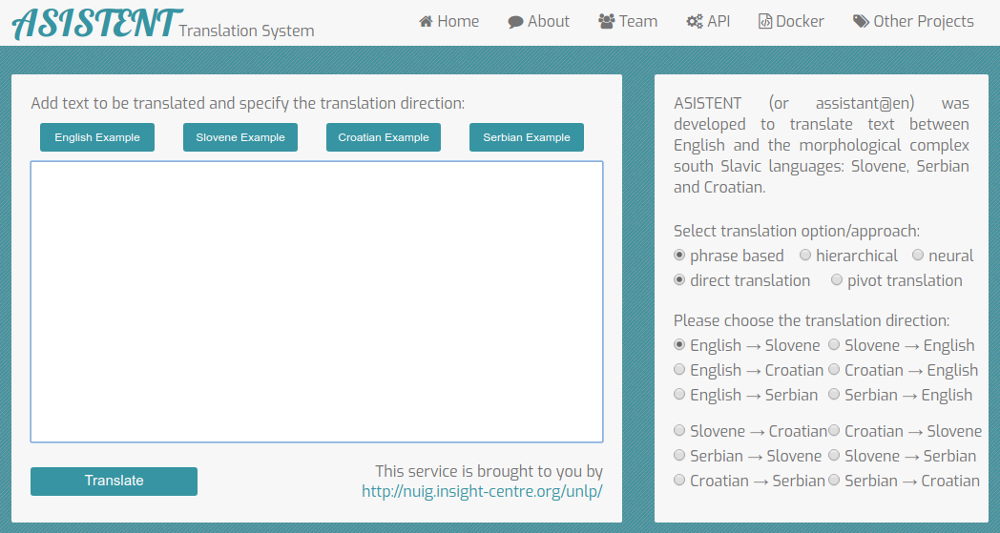

# Asistent

ASISTENT (or assistant@en) was developed to translate text between English and the morphological complex south Slavic languages: Slovene, Serbian and Croatian.

The demo can be accessed @ http://server1.nlp.insight-centre.org/asistent/ , please use the docker files to build a local version of the translation system.

